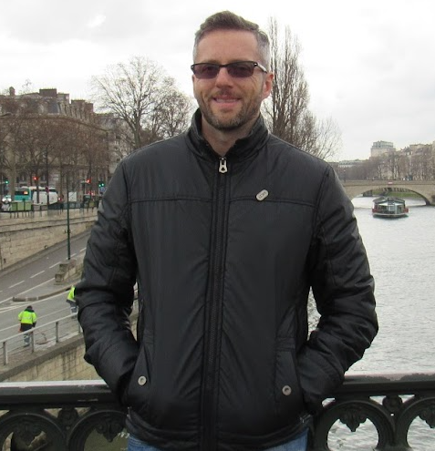
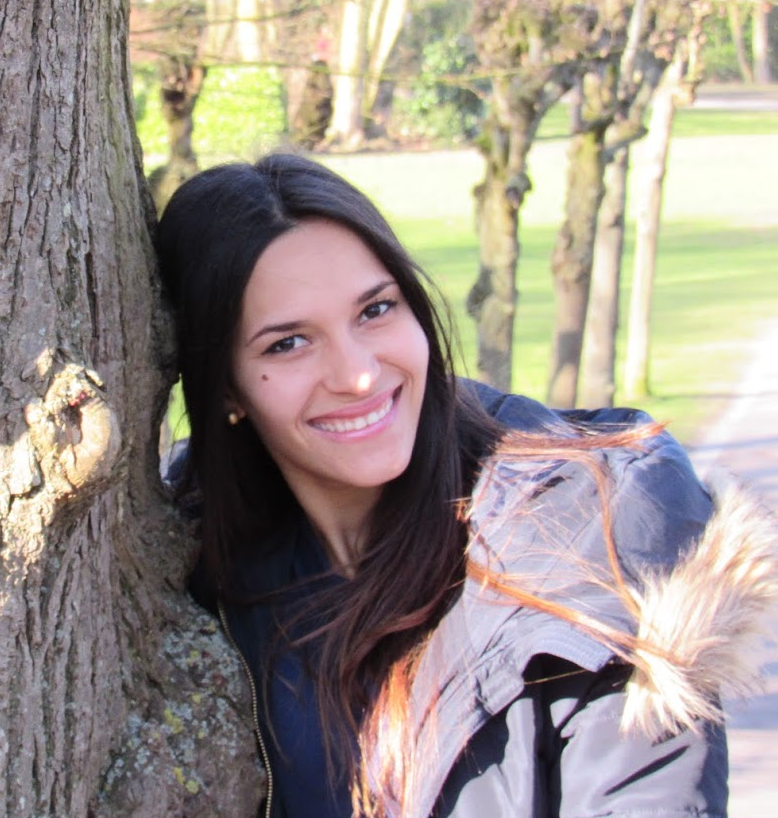

# Core team

The Neural Arena core team is currently formed by:

## **André Vicentini** - CEO & CTO
With over 24 years of experience as a software developer, skilled in programming languages such as C, C#, Java, Rust, Python, JavaScript, TypeScript, Solidity, and Motoko, along with an MBA in Project Management, "v1ctor" is known as a 10x engineer by his peers (though he modestly believes it to be an exaggeration!).  

His most notable open-source project is the FreeBASIC compiler, boasting over 1 million downloads in total, having seen collaboration from dozens of contributors and garnered thousands of users over the years. One of his projects also achieved 5th place at the Dfinity Supernova hackathon in 2022. Additionally, he enjoys participating in bounties and has secured first place in three of them, one from Dfinity and two from IcDevs.org.

His fascination with the Internet Computer began in 2018 when he stumbled upon an introductory thread about it on the bitcointalk.org forum. He was captivated by features such as 100% on-chain front and backend applications.  

Known for his strong work ethic and passion for software development and team management, he believes that Neural Arena represents the ideal convergence of games, crypto and AI, being the best app idea he has had in the past two decades in the field.

## **Michelle Luna** - graphic designer
Proficient in tools such as Figma and Inkscape, she excels at creating user-friendly and visually appealing interfaces.  

She loves computers and crypto (and dogs too)!

