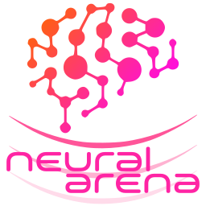

# Introduction

Let's discover what **Neural Arena is all about** in less than 2 minutes.

## TL;DR

- **Neural Arena** is a decentralized web3 game platform where users place their **AI-enhanced NFT characters (AI players)** to compete against each other in matches to **improve their NFT's experience** (XP) and to **win prizes**.
- Each **NFT** contains the visual features (the 3d model with animations and sound effects) and the weights and bias of its unique **artificial neural network** (NN) trained using **deep reinforcement learning** (RL). All the contents (the NN data, the 3d model and the sound effects) are **stored on-chain**.
- The games **run 100% on-chain** to ensure no match can be manipulated as there are no external interference, making hacking impossible!
- Neural Arena is **independent** of the games and NFT's hosted. Developers will soon be able to **publish their own games and NFT collections** using our Canister Development Kit (CDK) and our NFT generator.
- Neural Arena will be fully **open-source** when its SNS Decentralized Autonomous Organization (DAO) is launched. 

