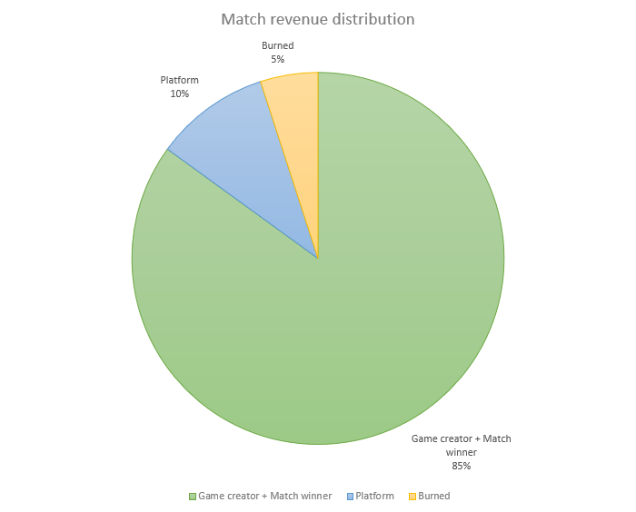

# Neural Arena Token

The ICRC-1 token, called NAT (Neural Arena Token), will be required to participate in matches and championships.

It will be also be used, when staked as a neuron, to participate on the DAO governance.

## Revenue distribution

After every match finishes, all NAT tokens paid by participating players are distributed as follows:

### Game creator + Match winner (85%)
The game creator will always receive the largest portion of the earnings. This is because the game canister will utilize its Cycles (which must be purchased using ICPs) to cover the costs of running the matches on the Internet Computer. Depending on the complexity of the game, billions of instructions may need to be executed for each player until the match is concluded.  

In addition to enhancing the rarity and value of their NFTs by gaining experience (XP), winners can also receive a portion of the tokens. It's up to the game to determine the amount it will distribute to the match's winner. For instance, if the game allocates 25% of the total match revenue to the winning player, and there are at least 4 players in a single match, the winner will have upgraded their NFT at no cost.

### Platform treasury (10%)
As a fee, the platform will deduct 10% of the earnings from each match, which will be transferred directly to the DAO's treasury account.

### Burned (5%)  
To offset the annual NAT inflation, which is used to reward NAT holders that have staked their tokens on neurons to participate in DAO governance, 5% of the match revenues will be burned. As the platform gains popularity, the impact of inflation on the token price will decrease.

## Cost to play
The fee charged for users to participate in a match is always determined by the game creator. Similar to web2, games should have the freedom to set the amount they will charge their players.
