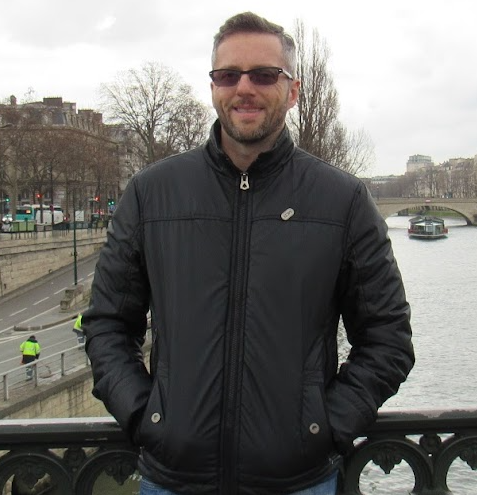
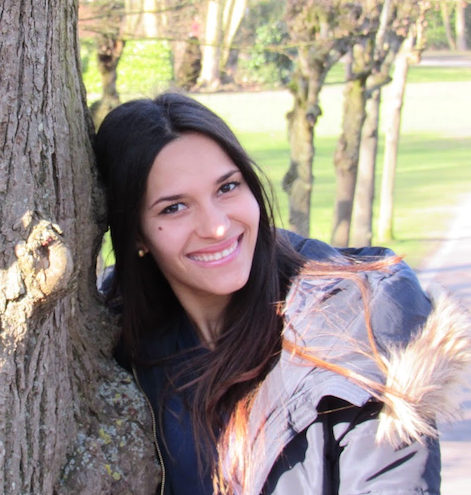

# Team

The Neural Arena core team, having received no seed funds or grants, currently consists of:

## **André Vicentini** - founder
With over 24 years of experience as a software developer, skilled in programming languages such as C, C#, Java, Rust, JavaScript, TypeScript, Solidity, and Motoko, along with an MBA in Project Management, his most notable open-source project is the FreeBASIC compiler, boasting over 1 million downloads in total, having seen collaboration from dozens of contributors from around the World and accumulating thousands of users over the years. He also achieved 5th place at the Dfinity Supernova hackathon in 2022, while he was still learning about Motoko and development of web3 apps on IC. Additionally, he enjoys participating in bounties and has secured first place in three of them, one from Dfinity and two from IcDevs.org.

Known for his strong work ethic and passion for software development and team management, he believes that Neural Arena represents the ideal convergence of games, crypto and AI, being the best app idea he has had in the past two decades being in the field.

## **Michelle Luna** - art director
Proficient in tools such as Figma and Inkscape, she excels at creating user-friendly and visually appealing interfaces and logos.  

She loves computers and crypto (and dogs too)!

