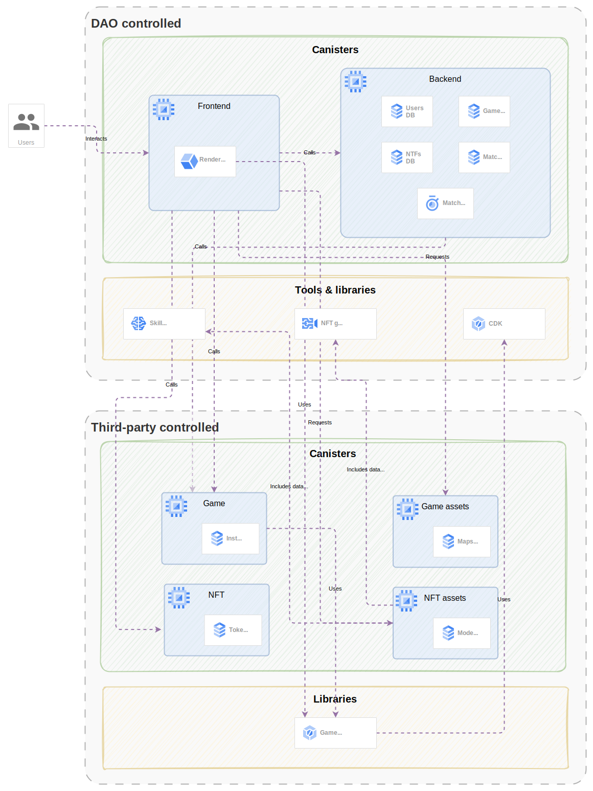

# Technology

Neural Arena isn't a simple web3 app or a basic smart contract. To make things work, numerous components and services are required, including:

|DAO controlled|Third-party controlled*|
|:--:|:--:|
|Backend canister|NFT canisters|
|Frontend canister|NFT asset canisters|
|Skill trainers|Game engines|
|NFT generators|Game canisters|
|Canister Development Kit|Game asset canisters|

*Note: The components and services at the third-party column can also be controlled by the Neural Arena DAO by either implementing them or acquiring them using funds from the DAO treasury.

## The big picture

