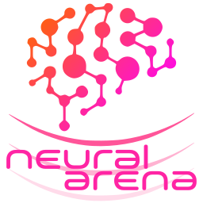

# Overview

As it could be expected after reading the introduction page, Neural Arena isn't a simple web3 app or a basic smart contract. To make things work, numerous components and services are required, including:

|DAO implemented|Third-party implemented|
|:--:|:--:|
|Backend canister|NFT canisters|
|Frontend canister|NFT asset canisters|
|Skill trainers|Game engines|
|NFT generators|Game canisters|
|Canister Development Kit|Game asset canisters|
|Rendering engines| |

## The big picture

