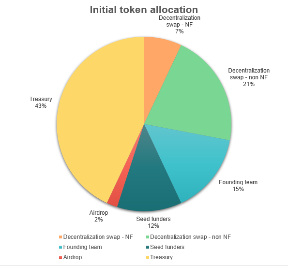

# Allocation

## At the genesis

When the SNS DAO is successfully launched, the allocation of the total supply of $NAT will be as follows:

Note: Assuming 65,000 ICP as the Neuron Fund (NF) participation; however, this value can fluctuate daily and will only be known exactly when the swap ends.

### SNS Sale
**21%** of the supply, or **21,000,000** (twenty-one million) tokens, will be made available for sale, to raise funds and decentralize the platform governance.  

To be part of the SNS decentralization swap, the participants must deposit ICP into the SNS to receive NAT tokens in proportion to the ICP deposited, depending on the quantity of ICP raised in total at the final.  

The tokens will be divided into 7 neurons of equal value, with dissolve delays of 0, 3, 6, 9, 12, 15 and 18 months.

### Founding Team
**18%** of the supply, or **18,000,000** (eighteen million) tokens, will be allocated to the founding team.  

The team will receive a basket of 16 neurons, each with equal values. These tokens will be released over a period of **4 years**, in equal portions at intervals of 3 months. Each neuron will have a dissolve delay of 1 month.

This structure ensures the team's long-term interest in the success of the project and guarantees their commitment to the platform.

### Treasury
**61%** of the supply, or **61,000,000** (sixty-one million) tokens, will be allocated to the DAO's treasury.  

The treasury, under complete control of the DAO, serves as a strategic reserve to be utilized for approved purposes such as partnerships, grants to NFT creators and game developers, prizes in future championships, community airdrops, token burning, and so on.

