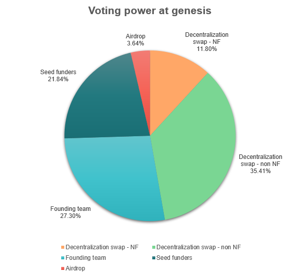

# Governance

## Overview

Anyone will be able stake NAT to earn new NAT in the form of voting rewards. Staking NAT will create a neuron that can vote on proposals that update, manage, and configure the platform. A neuron can also be configured to vote automatically by following other neuron.

## Voting power

With the parameters defined at the configuration page, the voting power at genesis will be divided between the sale participants and the founding team (assuming 100% of participation) as follows:

In conclusion, as illustrated in the chart above, the team will possess less voting power than the other participants: 48.06% vs 51.94%.

## First proposals

After the decentralization swap is finished, the team will submit proposals to the Neural Arena DAO that include:

- Transfer ICP and NAT to DEXes to enable trading of the tokens and add liquidity.
- Establish of a Neural Arena DAO Association in Switzerland to provide us an official recognition, protect our community and team, empowering the platform to operate with confidence, credibility, and a robust legal framework.
- Contract an auditing firm to do a complete code review.
- Motions to list NAT in crypto price data sites, such as CoinMarkCap and Coingecko.
- Lock 85.0% of the ICP treasury on 6 NNS neurons, with ICP being staked as follows: 15.0% for 6 months, 12.5% for 12 months, 12.5% for 18 months, 15% for 24 months, 10% for 36 months, and 20% for 48 months.
- Request ICP to cover the expenses budget for operations, compensation, and team expansion, after submitting a detailed proposal.
