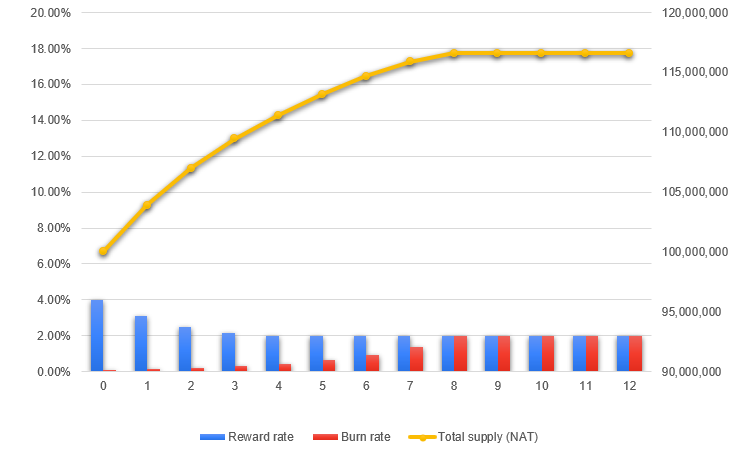

# Inflation

As specified in the configuration page, considering an initial reward of 4% and a final reward of 2% after 8 years, with an initial burning rate of 0.1% and a final burning rate of 2% after 10 years, the supply over time will evolve as follows:

| Year | Reward rate | Minted (NAT) | Burn rate | Burned (NAT) | Total supply   (NAT) |
|:----:|:-----------:|-------------:|----------:|-------------:|---------------------:|
|   0  |    4.00%    |   4,000,000  |   0.10%   |   -100,000   |      100,000,000     |
|   1  |    3.53%    |   3,668,969  |   0.13%   |   -140,190   |      103,900,000     |
|   2  |    3.13%    |   3,357,149  |   0.18%   |   -195,581   |      107,428,778     |
|   3  |    2.78%    |   3,075,794  |   0.25%   |   -271,660   |      110,590,347     |
|   4  |    2.50%    |   2,834,862  |   0.33%   |   -375,841   |      113,394,480     |
|   5  |    2.28%    |   2,642,908  |   0.45%   |   -518,113   |      115,853,501     |
|   6  |    2.13%    |   2,507,039  |   0.60%   |   -711,902   |      117,978,297     |
|   7  |    2.03%    |   2,432,898  |   0.81%   |   -975,173   |      119,773,434     |
|   8  |    2.00%    |   2,424,623  |   1.10%   |  -1,331,798  |      121,231,159     |
|   9  |    2.00%    |   2,446,480  |   1.48%   |  -1,813,170  |      122,323,985     |
|  10  |    2.00%    |   2,459,146  |   2.00%   |  -2,459,146  |      122,957,294     |
|  11  |    2.00%    |   2,459,146  |   2.00%   |  -2,459,146  |      122,957,294     |
|  12  |    2.00%    |   2,459,146  |   2.00%   |  -2,459,146  |      122,957,294     |

Note: The presented burn rate is a theoretical value. Tokens can be burned by proposals and are also burned when every match is finished (read the Token section). The popularity of the platform directly influences the amount of $NAT that will be burned.