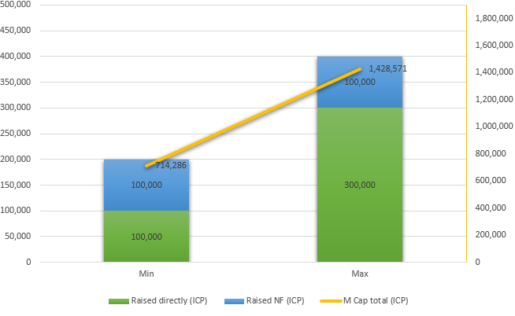

# Market cap

With 28% of the total supply for sale, the market cap range will be:

### Circulating supply

| Raised directly (ICP) | Raised NF (ICP) | M Cap (ICP) | M Cap (USD) |
| --------------------: | --------------: | --------------: | --------------: |
| 100,000 | 100,000 | 407,143 | $2,850,000 |
| 300,000 | 100,000 | 814,286 | $5,700,000 |

### Fully diluted

| Raised directly (ICP) | Raised NF (ICP) | M Cap (ICP) | M Cap (USD) |
| --------------------: | --------------: | --------------: | --------------: |
| 100,000 | 100,000 |  714,286 |  $5,000,000 |
| 300,000 | 100,000 | 1,428,571 | $10,000,000 |

Notes:
1. For the circulating supply calculation, the ICPCoins formula was used (at genesis):  
<small>**circulating_supply = total_supply - treasury** (see: [defi_aggregator](https://github.com/Neutrinomic/defi_aggregator/blob/4659c3592ababa5e8c94257e26161773e43090df/src/main.mo#L1162))</small>
2. For the fully diluted calculation, the total supply at genesis was used
3. Considering a ICP/USD ratio of $ 7,00
4. Assuming 100,000 ICP as the Neuron Fund (NF) participation; however, this value can fluctuate daily and will only be known exactly when the swap ends.
