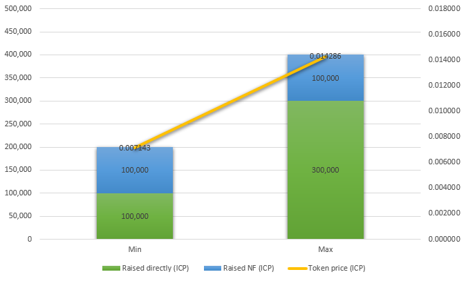

# Price

With 21% of the total supply for sale, the price range of each NAT token will be:

| Raised directly (ICP) | Raised NF (ICP) | Token price (ICP) | Token price (USD) |
| --------------------: | --------------: | ----------------: | ----------------: |
| 150,000 | 65,000 | 0.010 | $ 0.15 |
| 300,000 | 65,000 | 0.017 | $ 0.25 |

Notes: 
1. Considering a ICP/USD ratio of $ 15,00
2. Assuming 65,000 ICP as the Neuron Fund (NF) participation; however, this value can fluctuate daily and will only be known exactly when the swap ends.
