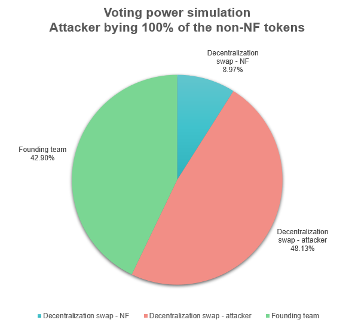

# Risks

## Hostile takeover

With the parameters defined on the configuration page, even if the attacker were to buy 100% of the non-NF tokens and stake them for the maximum period, the founding team and the NF swap would still have the majority of votes. This would make it impossible for a hostile takeover of the DAO to occur.

