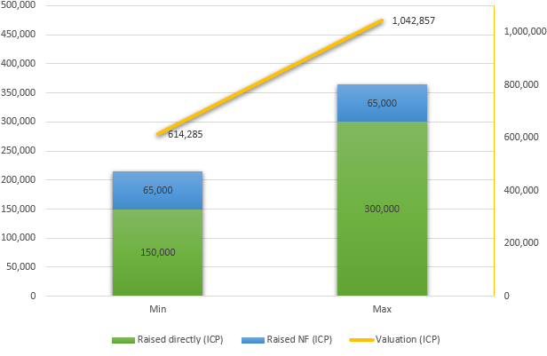

# Valuation

With 21% of the total supply for sale, the valuation range (market cap) will be:

| Raised directly (ICP) | Raised NF (ICP) | Valuation (ICP) | Valuation (USD) |
| --------------------: | --------------: | --------------: | --------------: |
| 150,000 | 65,000 | 1,023,809 | $ 12,285,714 |
| 300,000 | 65,000 | 1,738,095 | $ 20,857,142 |

Notes:

1. Considering the total supply at genesis, not just the circulating supply, so it is the **fully-diluted valuation/market cap**
2. Considering a ICP/USD ratio of $ 12,00
3. Assuming 65,000 ICP as the Neuro Fund (NF) participation; however, this value can fluctuate daily and will only be known exactly when the swap ends.
